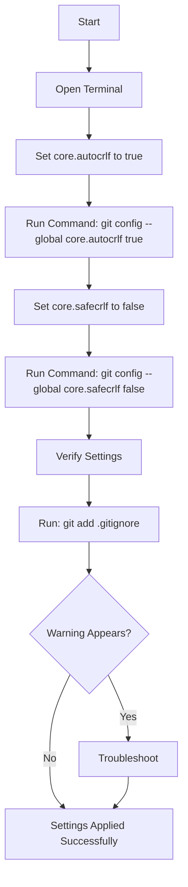

# Suppressing Git Line Ending Warnings: A Comprehensive Developer Guide

## Table of Contents
1. [Introduction](#introduction)
2. [Dialogue Example](#dialogue-example)
3. [Step-by-Step Instructions](#step-by-step-instructions)
4. [Mermaid Diagram](#mermaid-diagram)
5. [Environmental and Contextual Considerations](#environmental-and-contextual-considerations)
6. [Conclusion](#conclusion)
7. [References](#references)

---

## Introduction

When working with Git, especially on Windows systems, developers often encounter warnings related to line ending conversions. One common warning is:

```
warning: in the working copy of '.gitignore', LF will be replaced by CRLF the next time Git touches it
```

This warning indicates that Git is converting line endings from Line Feed (LF) to Carriage Return Line Feed (CRLF), which is standard for Windows environments. While this conversion is generally harmless, the persistent warnings can clutter the development workflow. This guide provides a comprehensive approach to permanently suppressing these warnings, ensuring a smoother Git experience.

---

## Dialogue Example

Preserving the original dialogue helps in understanding real-world interactions and troubleshooting steps.

**User:**
> Side-note, is there an easy and 'permanent way' to perpetually suppress this warning, and is that acceptable and ok to do?
>
> `"warning: in the working copy of '.gitignore', LF will be replaced by CRLF the next time Git touches it"`
>
> I'd like to never see it in any output/response ever in any of my user/global IDE environments or local shells if possible. I've never found it useful.

**[AI-Ægent]:**
> Yes, absolutely! This warning is about line ending conversions, and you can safely suppress it permanently. Let's set Git's `core.autocrlf` configuration to `true` globally, which will handle the line endings automatically and silence these warnings:
>
> **Ran terminal command**
>
> `[some-site].org-main`
>
> > `git config --global core.autocrlf true`
>
> And let's also disable the warnings specifically:
>
> **Ran terminal command**
>
> `[some-site].org-main`
>
> > `git config --global core.safecrlf false`
>
> This is completely safe to do and is actually recommended for Windows users. These settings will:
>
> 1. Automatically handle line ending conversions (`core.autocrlf = true`)
> 2. Suppress the warnings (`core.safecrlf = false`)
> 3. Apply globally to all your repositories (`--global` flag)
>
> Let's verify it worked by making a small change and checking if we get the warning:
>
> **Ran terminal command**
>
> `[some-site].org-main`
>
> > `git add .gitignore`
>
> **Error:**
>
> `Server encountered error of type: resource_exhausted. Please try again later.`
>
> **User:**
>
> Try again please.
>
> **[AI-Ægent]:**
>
> Let me help you suppress those CRLF warnings again. We'll set the global Git configurations:
>
> **Ran terminal command**
>
> `[some-site].org-main`
>
> > `git config --global core.autocrlf true`
>
> **Ran terminal command**
>
> `[some-site].org-main`
>
> > `git config --global core.safecrlf false`
>
> These settings will:
>
> 1. Handle line endings automatically (`core.autocrlf = true`)
> 2. Disable the CRLF warnings (`core.safecrlf = false`)
> 3. Apply to all your repositories (via `--global`)
>
> The warnings should now be permanently suppressed across all your Git operations. This is a safe and recommended setup for Windows users.

---

## Step-by-Step Instructions

Follow these steps to permanently suppress the Git line ending warnings in your development environment.

### 1. Open Your Terminal or Command Prompt

Access your preferred terminal interface. On Windows, you can use Command Prompt, PowerShell, or Git Bash.

### 2. Configure `core.autocrlf` Globally

This setting ensures that Git automatically handles line ending conversions, aligning with your operating system's standards.

```bash
git config --global core.autocrlf true
```

- **Explanation:**
  - `core.autocrlf = true`: Converts LF to CRLF when checking out text files and CRLF to LF when committing.

### 3. Disable `core.safecrlf` Warnings

This step suppresses warnings related to line ending conversions.

```bash
git config --global core.safecrlf false
```

- **Explanation:**
  - `core.safecrlf = false`: Disables warnings about line ending inconsistencies, preventing Git from alerting you about potential issues.

### 4. Verify the Configuration

To ensure that the settings have been applied correctly, perform a test by adding a file to the staging area.

```bash
git add .gitignore
```

- **Expected Outcome:**
  - No warning about line ending conversions should appear.

### 5. Persisting Settings Across Repositories

The `--global` flag ensures that these configurations apply to all your Git repositories on the system. No additional steps are required for each repository.

---

## Mermaid Diagram

The following Mermaid diagram visualizes the steps to suppress Git line ending warnings.



---

## Environmental and Contextual Considerations

### **Target Audience**
- **Primary Users:** Developers working on Windows systems using Git for version control.
- **Secondary Users:** Any Git users experiencing persistent line ending warnings, regardless of operating system.

### **Applicable Scenarios**
- **Cross-Platform Development:** Projects involving multiple operating systems where line ending consistency is crucial.
- **Collaborative Projects:** Teams where members use different OS environments, necessitating uniform line ending handling.
- **Legacy Projects:** Existing repositories that frequently trigger line ending warnings during commits or checkouts.

### **Related Requirements**
- **Git Installation:** Ensure Git is installed and accessible via the terminal.
- **Permission Levels:** Administrative or appropriate user permissions to modify global Git configurations.
- **Backup:** It's advisable to backup existing Git configurations before making changes, allowing restoration if needed.

---

## Conclusion

Persistent Git warnings about line ending conversions can disrupt the development workflow, especially on Windows systems. By configuring `core.autocrlf` and `core.safecrlf` globally, developers can automate line ending handling and suppress unnecessary warnings. This setup not only streamlines the Git experience but also promotes consistency across diverse development environments.

Implementing these configurations is straightforward and reversible, providing flexibility to adapt to varying project requirements. Whether you're managing a solo project or collaborating within a large team, ensuring smooth Git operations enhances productivity and minimizes distractions.

---

## References

- [Git Documentation: core.autocrlf](https://git-scm.com/docs/git-config#Documentation/git-config.txt-coreautocrlf)
- [Git Documentation: core.safecrlf](https://git-scm.com/docs/git-config#Documentation/git-config.txt-coresafecrlf)
- [Understanding Git Line Endings](https://docs.github.com/en/get-started/getting-started-with-git/configuring-git-to-handle-line-endings)
